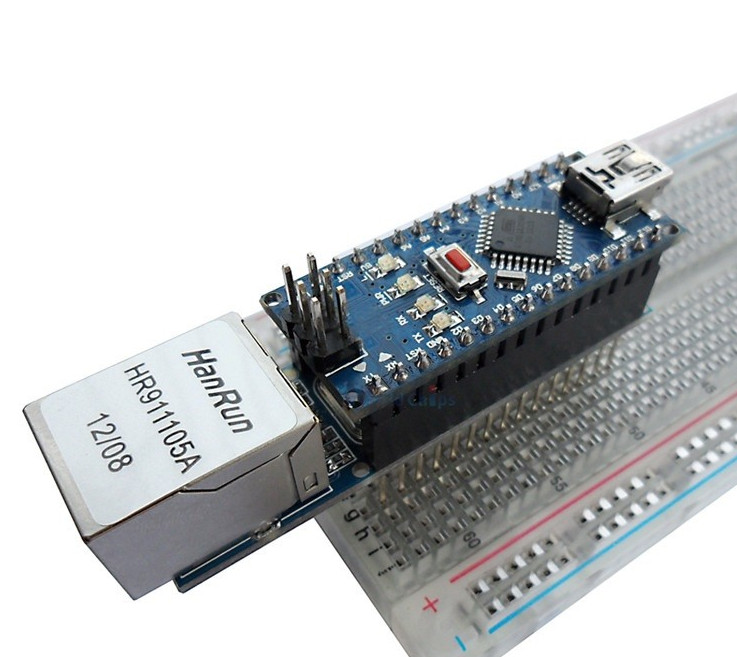

# Remote Wake-On-Lan from internet

This solution uses 1 Arduino Nano board with an ethernet module enc28j60 to check the remote WOL signal from internet and wakeup your PC.

## Why this solution?

- Don't have to do port forwarding.

- Cheap hardware (Arduino Nano + enc28j60).

## Deloyment

- Edit `web/config.json` to change WOL password (to use in web UI to wake up for PC), mac address of your target PC.

- Deloy `web` folder to a server (you can use Heroku for free).

- Edit `arduino/wol/wol.ino` to change `example.domain.com` to your domain (of deployed server - from Heroku if you use that service).

- Import `EtherCard.zip` and `Regexp.zip` to your Arduino IDE.

- Compile and deploy `arduino/wol/wol.ino` to Arduino.

- Access the delopyed website address and use WOL here. You have to use configured password to wake up your target PC.
